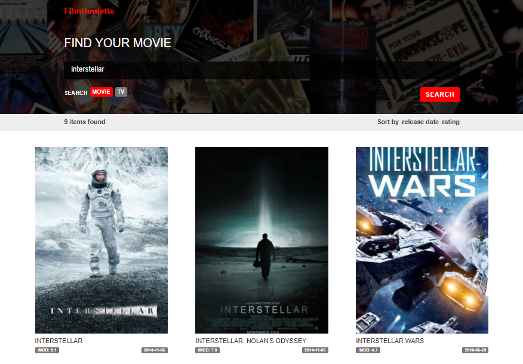

# FilmRoulette

[](https://travis-ci.org/beksultan28/FilmRoulette)
[](https://codeclimate.com/github/beksultan28/FilmRoulette/test_coverage)
[](https://codeclimate.com/github/beksultan28/FilmRoulette/maintainability)

Simple SPA for searching Films and TV Shows on [The Movie Database (TMDb)](https://www.themoviedb.org/).

# 


## Getting Started

### Prerequisites

1. Git
2. Node: version v6.11.2 or greater
3. Yarn: [See Yarn website for installation instructions](https://yarnpkg.com/lang/en/docs/install/)

### Installing

```sh
$ git clone https://github.com/beksultan28/FilmRoulette.git
$ cd FilmRoulette
$ yarn
```

### Building

```sh
$ yarn build #result will be generated to the 'build' folder
$ yarn build-with-test #to run tests before the build
```

### Starting production server
**Note:** You must [build](#building) the project before starting production server

```sh
$ yarn start-server #this will start production server with server-side rendering
$ open http://localhost:3000/
```

### Running local development server

```sh
$ yarn start #to start the hot-reloading development server

open http://localhost:3030/
```

### Running the tests

```sh
$ yarn test #to run all the tests
$ yarn test -- folder_name/* #to run the tests in specific directory
$ yarn test -- --coverage #to run the tests with coverage information. Result will be generated to the 'coverage' folder
```

### Generating documentation

```sh
$ yarn docs #result will be generated to the 'docs' folder
```

## Built With

* [ReactJS](https://reactjs.org/) - a JavaScript library for building user interfaces
* [Redux](http://redux.js.org/) - state container for JavaScript apps
* [Webpack](https://webpack.js.org/) - bundilng and development server with hot-reloading
* [Babel](https://babeljs.io/) - transpiling es6 and JSX to es5
* [ESLint](https://eslint.org/) - linting JavaScript and JSX
* [Jest](https://facebook.github.io/jest/) - testing
* [JSDoc](http://usejsdoc.org/) - an API documentation generator for JavaScript
* [Express](https://expressjs.com/) - web framework for production server with SSR

## License

This project is [MIT licensed](LICENSE)
